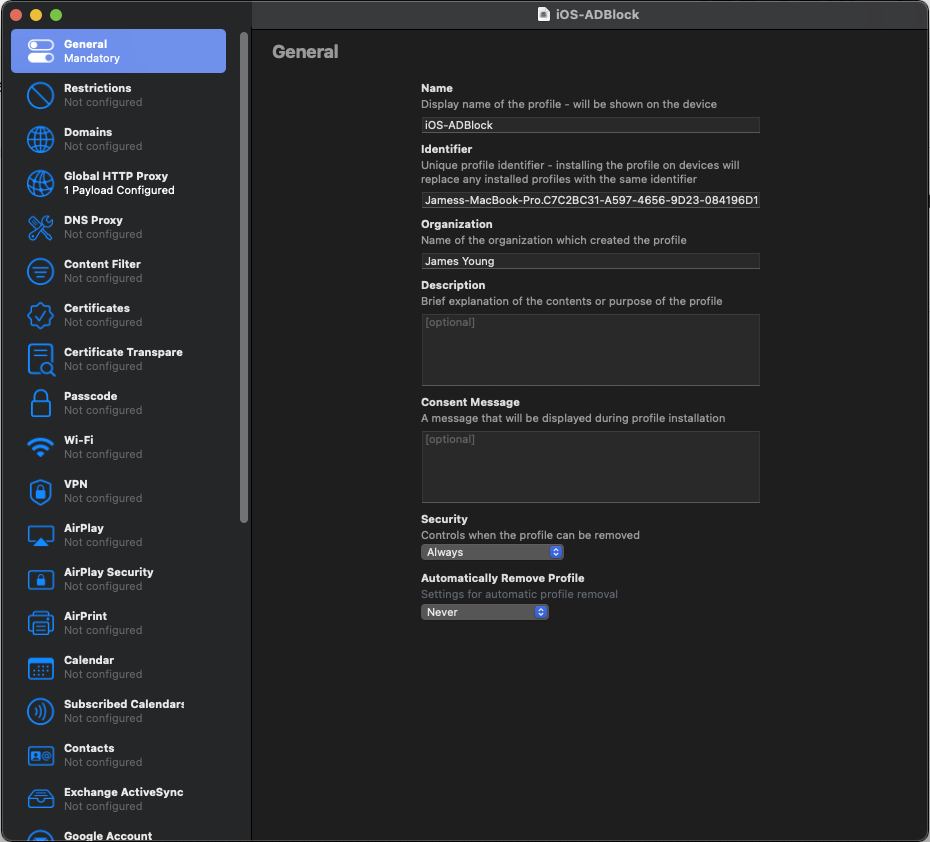
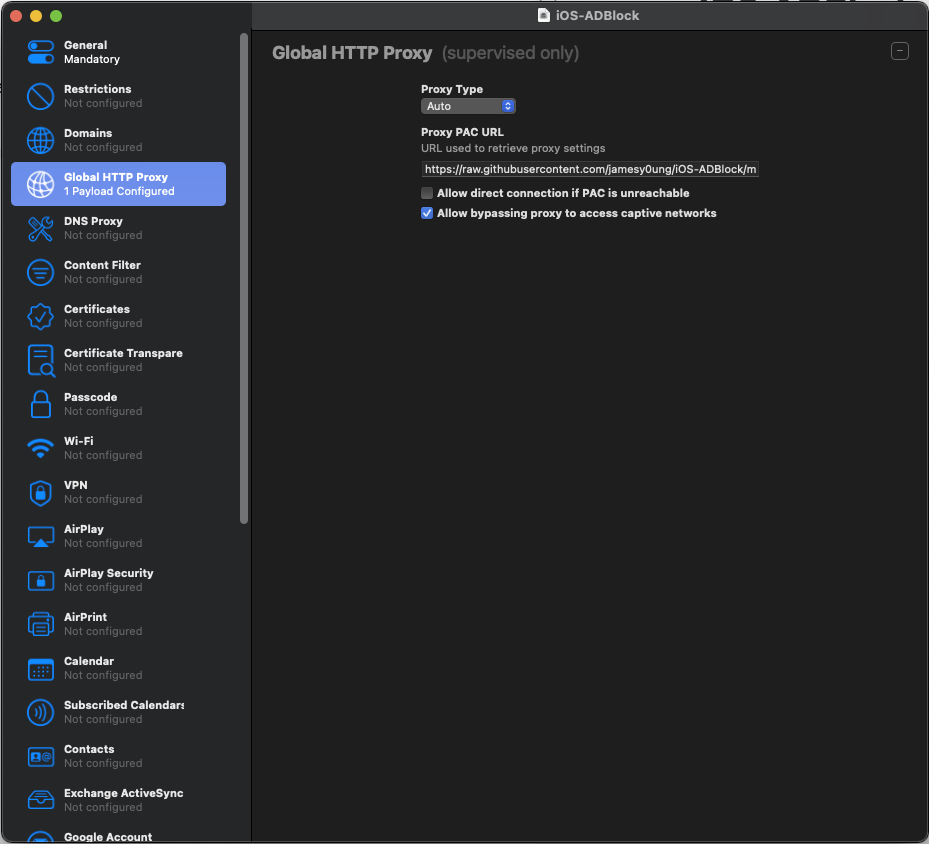

# iOS-ADBlock 
## Intro
ADBlock setup for iOS, based on EasyList, but allows Siri and other Apple services to work.
## Usage
Device **must** be supervised via Apple Configurator, or iSupervisor if jailbroken. Install profile and the ad block is immediately active. 
## Profile
Screenshots are included for the lazy, you can open the profile in Apple Configurator and the blocklist and inspect for yourself.

